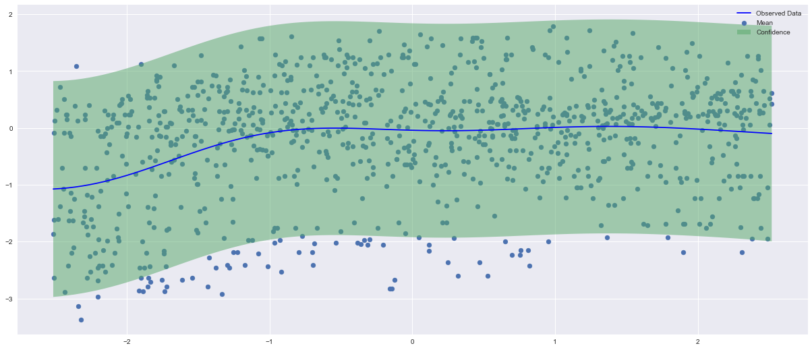
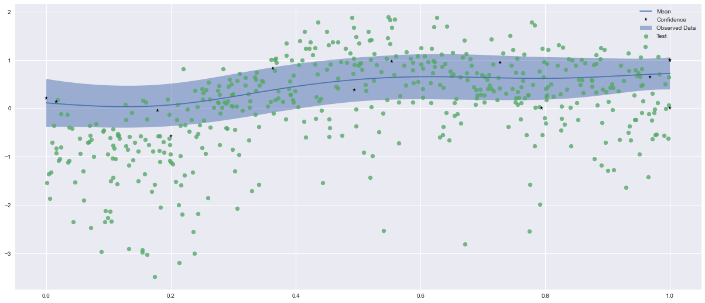

# MFBO Method
**A Multi-Fidelity Bayesian Method for Complex Model Optimization: An Industrial Case Study**

MFBO is an efficient method for reducing uncertainty using multi fidelity and Bayesian optimization with a general overview of possible acquisition functions. It is developed for a graduate project at [Politecnico di Milano](https://www.polimi.it/) in a joint collaboration with [Università della Svizzera italiana](https://www.usi.ch).

### Installation
This tutorial required Anaconda or mamba being installed. After cloning the repository, set up the python environment using the command:
```sh
conda env create -f advpy.yml
```
Or fork the repository for having your own copy. The main modules depends on [botorch](https://botorch.org/) and [pytorch](https://pytorch.org/).

### Abstract
The complete paper can be found in the [report](https://github.com/carls31/MFBO-Method/blob/main/Report_10601118.pdf) file.

Computational models are often evaluated via stochastic simulation or numerical approximation. Fitting these models implies a difficult optimization problem over complex, possibly noisy parameter landscapes. The need for multiple realizations, as in uncertainty quantification or optimization, makes surrogate models an attractive option. For expensive high-fidelity models, however, even performing the number of simulations needed for fitting a surrogate may be too expensive. Inexpensive but less accurate low-fidelity data or models are often also available. Multi-fidelity combine high-fidelity and low-fidelity in order to achieve accuracy at a reasonable cost. Here we consider an hybrid method based on Multi-fidelity for implementing a Bayesian optimization algorithm. At the heart of this algorithm is maximizing the information criterion called acquisition function, and a list of the possible available choices is presented. Multi-fidelity Bayesian optimization achieves competitive performance with an affordable computational overhead for the running time of non-optimized models. We compare the results created be six acquisition functions, with Expected Improvement EI performing best.

Here, it is shown the initial green uncertainty level described by the standard deviation before the MFBO method is applied:


Following, it is shown the EI acquisition function outcome applied to one input (angle of the cargo-wing industrial test case):


Finally, it is shown the result provided again by EI acquisition function after PCA performing, this time applied to all the inputs:


[1][L. Bonfiglio. Optimization and performance predictions using machine learning and
stochastic multi-fidelity modeling, 2018](https://web.mit.edu/~bonfi/www/multi-fidelity.html)

[2][C. E. Rasmussen & C. K. I. Williams, Gaussian Processes for Machine Learning, the MIT Press, 2006, ISBN 026218253X](http://gaussianprocess.org/gpml/)

[3][P. I. Frazier. A tutorial on bayesian optimization,
2018](https://arxiv.org/abs/1807.02811)

[4][B. Letham, B. Karrer, G. Ottoni, and E. Bakshy. Constrained bayesian optimization
with noisy experiments, 2018](https://arxiv.org/abs/1706.07094)

[5][S. Li, W. Xing, R. M. Kirby, and S. Zhe. Multi-fidelity bayesian optimization via deep
neural networks experiments, 2020](https://proceedings.neurips.cc/paper/2020/hash/60e1deb043af37db5ea4ce9ae8d2c9ea-Abstract.html)

[6][P. Hennig, M. A. Osborne, and H. P. Kersting. Probabilist numerics. Cambridge
University Press, 2022]( https://doi.org/10.1017/9781316681411)

[7][A. Zhang, Z. C. Lipton, M. Li, and A. J. Smola. Dive into deep learning](https://d2l.ai/)
